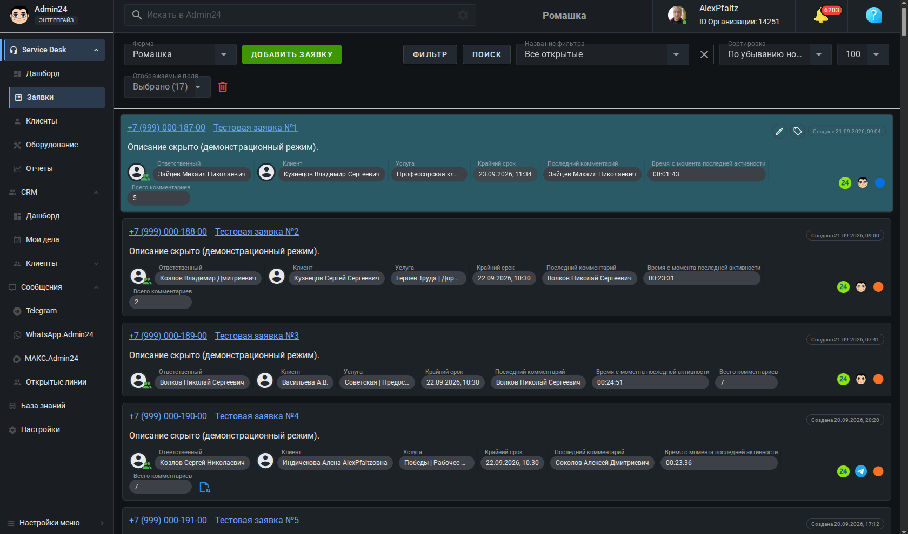
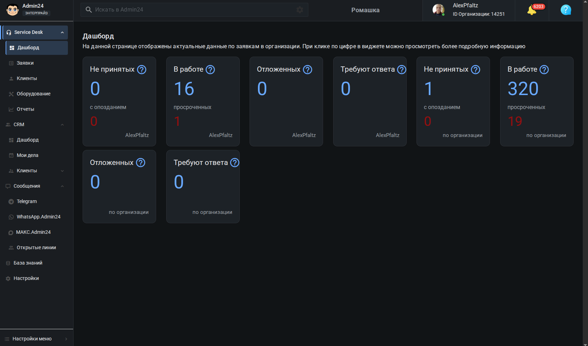
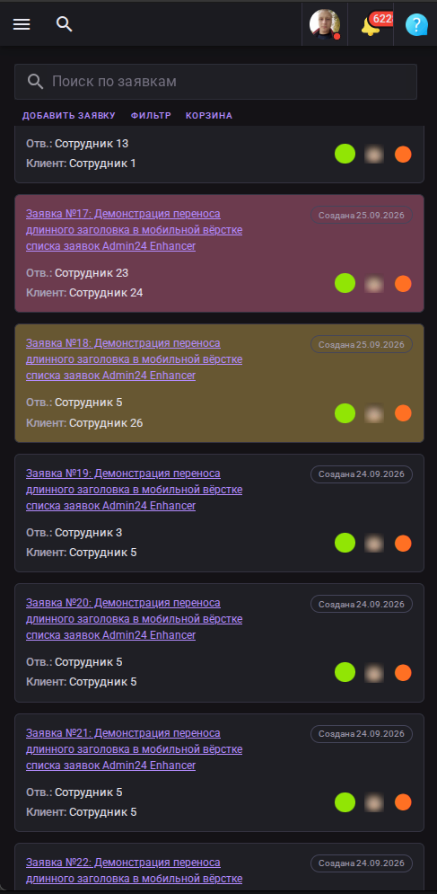
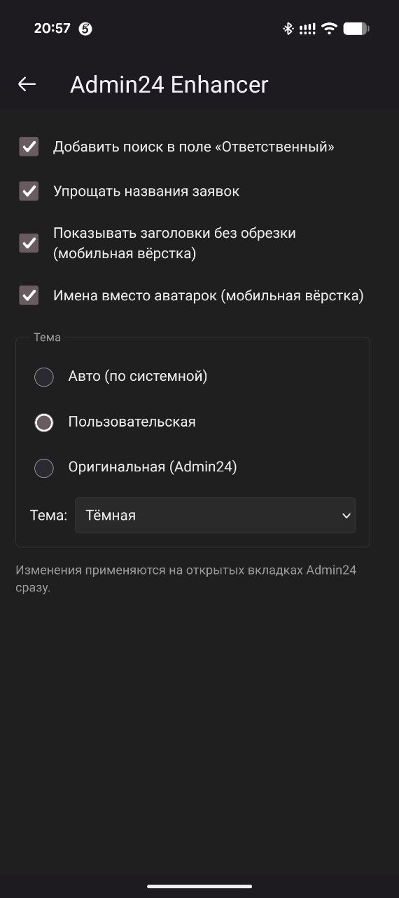
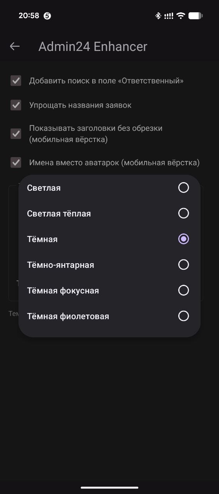
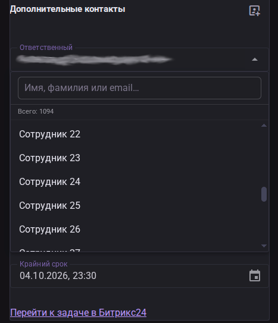

# Admin24 Enhancer

Браузерное расширение (Firefox + Chrome, Manifest V3) для платформы
Admin24. Делает интерфейс удобнее: полные названия заявок в мобильной
вёрстке списка, имена вместо аватарок в мобильной вёрстке, поиск в поле
«Ответственный» в детальной заявке, несколько тем оформления — включая
тёмные.

Работает на любом SaaS-инстансе Admin24 (`*.admin24.app`).
Вёрстку Admin24 не ломает, нативные клики не перехватывает.

## Возможности

- **Полные названия заявок** — снимает обрезку (`text-overflow: ellipsis`)
  в мобильной вёрстке списка заявок. Наименование видно целиком.
- **Имена вместо аватарок** — в мобильной вёрстке у «Ответственного»
  и «Клиента» показывались только иконки (без фото и без имени).
  Расширение подписывает их текстом: «Ответственный: ФИО»,
  «Клиент: ФИО». Работает для всех карточек, устойчиво к пагинации.
- **Упрощение названий** — убирает служебный префикс
  «Заявка с формы [ Форма ]» у заголовков карточек.
- **Поиск в поле «Ответственный»** — вместо сломанного `v-select`
  Admin24 (с автовыбором по первой букве) в детальной заявке
  открывается поиск по списку сотрудников.
- **Темы оформления** — 6 палитр из коробки: светлые, тёмные. Режимы: авто (по системной), фиксированная, оригинальная
  (стоковая Admin24).

Все функции включаются и выключаются из popup расширения.

## Требования

- Node.js ≥ 20
- npm ≥ 10

## Сборка

```bash
npm install
npm run build
```

## Скриншоты

### Десктоп




### Мобильная вёрстка

<p align="center">
  
  
  
</p>

### Общие для всех платформ

