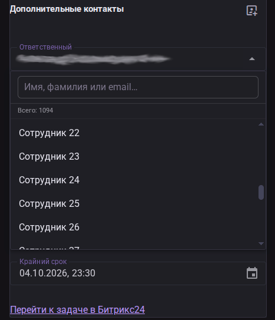
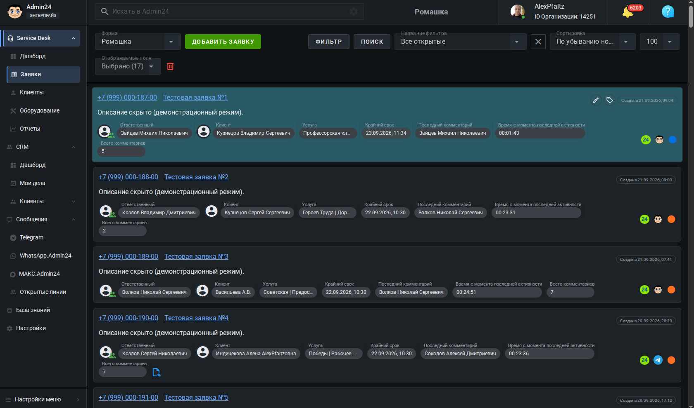
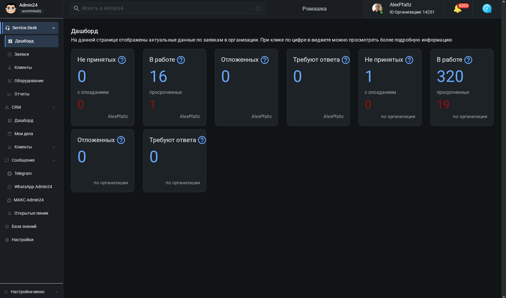
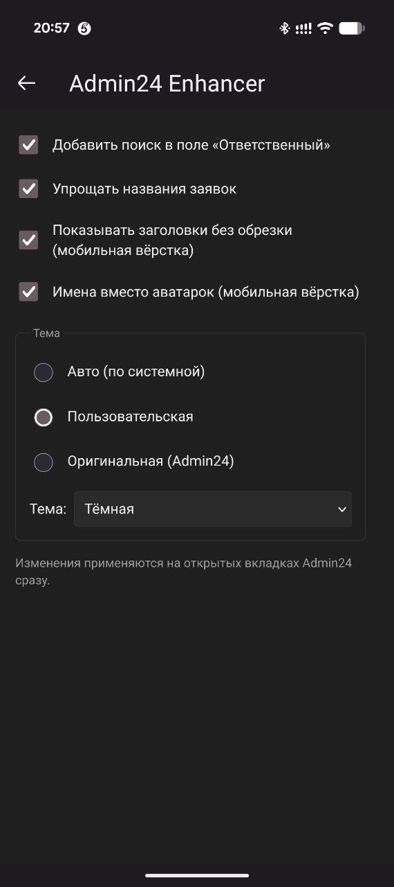
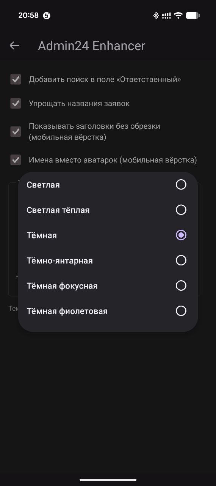
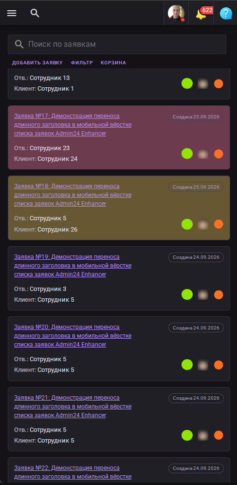

# Admin24 Enhancer

Браузерное расширение (Firefox + Chrome, Manifest V3) для платформы
Admin24. Делает интерфейс удобнее: убирает обрезку заголовков, показывает имена вместо иконок в мобильной вёрстке, упрощает служебные префиксы в названиях, добавляет поиск в поле «Ответственный» и предлагает 6 тем оформления.

Работает на любом SaaS-инстансе Admin24 (*.admin24.app). Тема оформления дополнительно применяется в Atlas24 Knowledge Base (app.atlas24.pro, внутри iframe).
Нативная вёрстка Admin24 сохраняется.

## Возможности

- **Полные названия заявок** — снимает обрезку (`text-overflow: ellipsis`) в списке заявок: наименование видно целиком, без «…». Работает в десктопной и мобильной вёрстке.
- **Имена вместо аватарок** — в мобильной вёрстке у «Ответственного» и «Клиента» Admin24 показывает только иконки. Расширение подписывает их текстом: «Отв.: ФИО», «Клиент: ФИО». Работает для всех карточек мобильного списка, устойчиво к пагинации.
- **Упрощение названий** — убирает служебный префикс «Заявка с формы [ Форма ]» у заголовков карточек.
- **Поиск в поле «Ответственный»** в детальной заявке вместо стандартного v-select открывается список сотрудников с поиском по имени, фамилии или email. Включается/выключается в popup: при выключении возвращается стоковое поведение Admin24.
- **Темы оформления** — 6 палитр из коробки: 2 светлые (обычная и тёплая) и 4 тёмные. Режимы: авто (по системной), фиксированная, оригинальная (стоковая Admin24).

Все функции включаются и выключаются из popup расширения.

## Требования

- Node.js ≥ 20
- npm ≥ 10

## Сборка

```bash
npm install
npm run build
```

## Скриншоты

### Общие для всех платформ



### Десктоп




### Мобильная вёрстка

<p align="center">
  
  
  
</p>